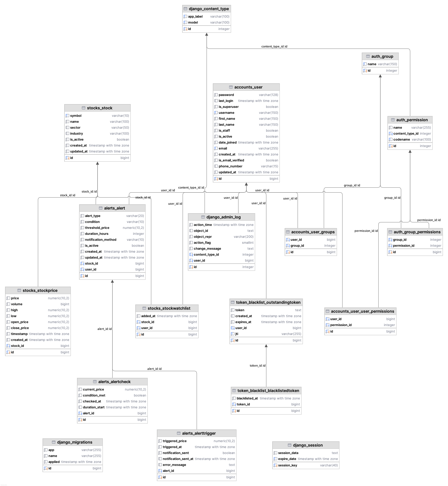

## MarketPulse

Stock alerts and market data API built with Django, Django REST Framework, Celery, Redis, and PostgreSQL. It lets users register/login with JWT, browse stocks and price history, manage watchlists, and create alert rules (threshold and duration) with email/console notifications. A periodic job fetches fresh market data and keeps the database tidy.



### Highlights
- **Auth**: JWT-based auth (access/refresh, rotation, blacklist). Custom user model `accounts.User`.
- **Stocks**: Symbols, latest prices, historical OHLCV, and a user watchlist.
- **Alerts**: Threshold/duration rules, triggers history, checks history, and notifications.
- **Async**: Celery worker + beat using Redis as broker/result backend.
- **API-first**: Clean REST endpoints with DRF. Postman collection included.
- **Ops**: Health endpoint, structured logging, Dockerized services.

---

### Table of Contents
- [Architecture](#architecture)
- [Requirements](#requirements)
- [Quick Start](#quick-start)
  - [Run with Docker](#run-with-docker)
  - [Run locally (Poetry)](#run-locally-poetry)
- [Environment Variables](#environment-variables)
- [Database](#database)
- [Data Seeding](#data-seeding)
- [Celery and Scheduled Jobs](#celery-and-scheduled-jobs)
- [API Overview](#api-overview)
- [Postman Collection](#postman-collection)
- [Health Check](#health-check)
- [Logging](#logging)
- [Testing](#testing)
- [Docs](#docs)
- [Deployment Notes](#deployment-notes)
- [AWS Free Tier Deployment](#aws-free-tier-deployment)
  - [Quick Start AWS Deployment](#quick-start-aws-deployment)
- [License](#license)

---

### Architecture
- **Django + DRF**: API backend, JWT auth, pagination, permissions.
- **Celery**: Background tasks for fetching market data, processing alerts, and cleanup.
- **Redis**: Message broker and result backend for Celery.
- **PostgreSQL**: Primary database in Docker; SQLite fallback in local dev if DB env vars are absent.
- **Gunicorn**: App server in Docker.
- **CORS**: Pre-configured for local frontend at `http://localhost:3000`.

Key modules:
- `apps/accounts`: Auth, profile, JWT endpoints.
- `apps/stocks`: Stocks, prices, watchlist, data ingestion tasks.
- `apps/alerts`: Alert models, endpoints, processing/notification tasks.

---

### Requirements
- Python 3.13+
- Poetry 2.x (for local dev)
- Docker and Docker Compose (optional, for containerized run)

---

### Quick Start

#### Run with Docker
```bash
docker compose up --build
```
Services:
- `web`: Django + Gunicorn on port `8000` (exposed as `http://localhost:8000`). Runs migrations and collectstatic on startup.
- `celery`: Celery worker.
- `beat`: Celery beat scheduler (persists schedule under `beat_data` volume).
- `db`: PostgreSQL 16.
- `redis`: Redis 7.

Default env for Docker is set in `docker-compose.yml`. For production, externalize secrets and adjust `ALLOWED_HOSTS`.

#### Run locally (Poetry)
1) Install deps:
```bash
poetry install
```
2) Configure env:
```bash
cp env.example .env
# then edit .env (set SECRET_KEY, REDIS_URL, DB_* or rely on SQLite fallback)
```
3) Migrate and create superuser:
```bash
poetry run python manage.py migrate
poetry run python manage.py createsuperuser
```
4) Run server:
```bash
poetry run python manage.py runserver 0.0.0.0:8000
```
5) Start Celery worker and beat in separate terminals:
```bash
poetry run celery -A MarketPulse worker -l info
poetry run celery -A MarketPulse beat -l info --schedule ./celerybeat-schedule
```

---

### Environment Variables
Use `.env` (see `env.example`) or Docker Compose env.

Core Django
- `SECRET_KEY`: Django secret key
- `DEBUG`: `True`/`False`
- `ALLOWED_HOSTS`: comma-separated hosts

Database (PostgreSQL)
- `DB_NAME`, `DB_USER`, `DB_PASSWORD`, `DB_HOST`, `DB_PORT` (defaults to `5432`)
  - If these are absent, the app falls back to SQLite at `BASE_DIR/db.sqlite3`.

Redis/Celery
- `REDIS_URL`: e.g. `redis://localhost:6379/0`

Stock API (Twelve Data free tier by default)
- `STOCK_API_KEY`
- `STOCK_API_BASE_URL` (default `https://api.twelvedata.com`)
- `STOCK_API_ENDPOINT` (default `time_series`)
- `STOCK_API_INTERVAL` (default `1min`)
- `STOCK_API_FORMAT` (default `JSON`)
- `STOCK_API_SIZE` (default `1`)
- `STOCK_TYPE` (default `stock`)

Email (for alert notifications)
- `EMAIL_HOST` (default `smtp.gmail.com`), `EMAIL_PORT` (default `587`), `EMAIL_USE_TLS` (default `True`)
- `EMAIL_HOST_USER`, `EMAIL_HOST_PASSWORD`

Optional placeholders (for deployment docs/reference)
- `AWS_ACCESS_KEY_ID`, `AWS_SECRET_ACCESS_KEY`, `AWS_STORAGE_BUCKET_NAME`, `AWS_S3_REGION_NAME`

---

### Database
- In Docker: PostgreSQL 16 with volumes.
- Locally: If `DB_*` env vars are not provided, SQLite is used automatically.

Migrations:
```bash
poetry run python manage.py migrate
```

---

### Data Seeding
Seed common stock symbols and names:
```bash
poetry run python manage.py seed_stocks
```

---

### Celery and Scheduled Jobs
- Broker/backend: `REDIS_URL`
- Beat schedule (see `MarketPulse/settings.py`):
  - `fetch_stock_data_batch`: runs every 60 seconds to enqueue fetches for popular tickers.
- Additional tasks:
  - `apps.stocks.tasks.cleanup_old_price_data`: prune older price rows (30 days).
  - `apps.alerts.tasks.process_*`: evaluate alerts and send notifications.
  - `apps.alerts.tasks.cleanup_old_alert_data`: prune old alert checks/triggers.

Run workers locally:
```bash
poetry run celery -A MarketPulse worker -l info
poetry run celery -A MarketPulse beat -l info
```

---

### API Overview
All endpoints are prefixed with `/api/v1/` unless noted. Default permission is authenticated; obtain JWT via auth endpoints. Use `Authorization: Bearer <access_token>`.

Auth (`apps.accounts`)
- `POST /api/v1/auth/register/`
- `POST /api/v1/auth/login/`
- `POST /api/v1/auth/logout/` (requires `refresh_token` in body)
- `GET/PATCH /api/v1/profile/`
- `POST /api/v1/token/refresh/`

Stocks (`apps.stocks`)
- `GET /api/v1/stocks/` — List active stocks with latest price
- `GET /api/v1/stocks/{symbol}/` — Stock details with latest price
- `GET /api/v1/stocks/{symbol}/prices/` — Latest 100 historical prices
- `GET/POST /api/v1/watchlist/` — List/add watchlist entries
- `DELETE /api/v1/watchlist/{id}/` — Remove from watchlist

Alerts (`apps.alerts`)
- `GET/POST /api/v1/alerts/` — List or create alerts
- `GET/PATCH/DELETE /api/v1/alerts/{id}/` — Manage alert
- `POST /api/v1/alerts/{id}/toggle/` — Toggle active state
- `GET /api/v1/alerts/statistics/` — Summary stats for user
- `GET /api/v1/alerts/checks/` — List condition checks
- `GET /api/v1/triggers/` — Trigger history
- `GET /api/v1/triggers/{id}/` — Trigger detail

Health
- `GET /health/` — Lightweight app/DB/Redis health response

Pagination & Rendering
- Page size 20 (DRF page-number). JSON renderer only.

---

### Postman Collection
Use the bundled collection to explore endpoints quickly.

1) Import the collection
- Open Postman → Import → Select `docs/MarketPulse API.postman_collection.json`.

2) Create an environment (recommended)
- Create a Postman environment (top-right) with variables:
  - `base_url`: `http://localhost:8000` (Docker or local run)

3) Get tokens
- Send `POST {{base_url}}/api/v1/auth/register/` or `POST {{base_url}}/api/v1/auth/login/` with email/password.
- Automatically sets `access_token` and `refresh_token` in environment variables using post-request scripts.

4) Authorize requests
- For protected requests, set header:
  - `Authorization: Bearer {{access_token}}`

5) Refresh token (optional)
- Use `POST {{base_url}}/api/v1/token/refresh/` with the `refresh` token to obtain a new access token.

---

### Health Check
`/health/` returns `200` when healthy and `503` if DB/Redis checks fail. Safe for load balancers and uptime probes.

---

### Logging
- Logs to console and `./logs/django.log` with structured format.
- Ensure `logs/` is writable. In Docker, it is created at build-time and at runtime.

---

### Testing
Run test suite with pytest:
```bash
poetry run pytest -q
```
---

### Docs
- Postman collection: `docs/MarketPulse API.postman_collection.json`
- Database schema image: `database-schema.png`

---

### Deployment Notes
- Use Docker images with environment overrides (never commit secrets). Set `DEBUG=0`, `SECRET_KEY`, and proper `ALLOWED_HOSTS`.
- Run three processes: web (Gunicorn), celery worker, celery beat. Each in a separate container or service.
- Provide persistent volumes for Postgres and Celery beat schedule. Externalize static/media as needed.
- Configure reverse proxy (Nginx/Caddy) to forward to `web:8000` and serve staticfiles or use a CDN.
- Ensure email credentials are set if using email notifications.
- For CORS, adjust `CORS_ALLOWED_ORIGINS` in settings for your frontend domain(s).

### Fly.io Deployment
MarketPulse has been deployed to Fly.io as a temporary deployment. The app is containerized using Docker and can be easily deployed to Fly.io's global infrastructure.

**Note**: This is a temporary deployment for testing and demonstration purposes.

### AWS Free Tier Deployment
MarketPulse can be deployed on AWS Free Tier services for cost-effective hosting. See the [complete AWS deployment guide](./aws-deployment-guide.md) for detailed instructions.

#### Basic AWS Deployment Steps

Here's how I deployed this app to AWS:

1. **AWS Account Setup**
   - Create account on aws.amazon.com
   - Free tier worked fine for me!

2. **EC2 Setup (The Server)**
   ```bash
   # After creating EC2 instance (t2.micro Amazon Linux 2023)
   # Save the .pem file somewhere safe!
   
   # Connect to your server
   chmod 400 your-key.pem
   ssh -i your-key.pem ec2-user@your-server-address
   ```

3. **Docker Setup**
   ```bash
   # These commands install Docker
   sudo yum update -y
   sudo yum install -y docker
   sudo systemctl start docker
   sudo systemctl enable docker
   sudo usermod -a -G docker ec2-user
   
   # Get Docker Compose too
   sudo curl -L "https://github.com/docker/compose/releases/download/v2.24.6/docker-compose-$(uname -s)-$(uname -m)" -o /usr/local/bin/docker-compose
   sudo chmod +x /usr/local/bin/docker-compose
   
   # Exit and reconnect
   exit
   ssh -i your-key.pem ec2-user@your-server-address
   ```

4. **App Deployment**
   ```bash
   # Get the code
   git clone https://github.com/azsharkawy5/MarketPulse.git
   cd MarketPulse
   
   # Setup environment
   cp env.example .env
   nano .env
   
   # Edit .env to set SECRET_KEY, REDIS_URL, DB_* (or use SQLite fallback) 

   # Run the app
   docker-compose -f docker-compose.prod.yml up -d
   docker-compose -f docker-compose.prod.yml exec web python manage.py createsuperuser
   docker-compose -f docker-compose.prod.yml exec web python manage.py seed_stocks
   ```


Note: I had some issues with security groups - remember to open ports 22 (SSH), 80 (HTTP) and 8000 in the AWS Console security group settings.

Next time I'd use a proper PostgreSQL RDS instance instead of SQLite, Redis ElastiCache for Celery, and S3 for static files. But this quick setup works fine for testing and small projects.

---

### License
MIT. See `pyproject.toml`.


